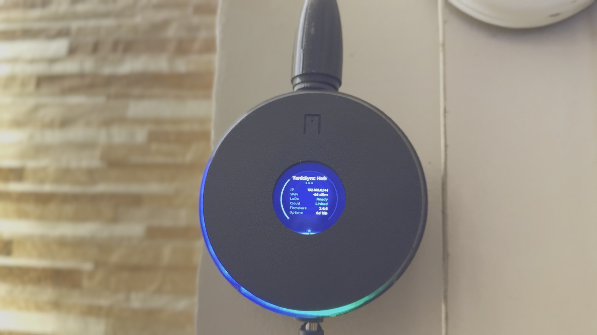
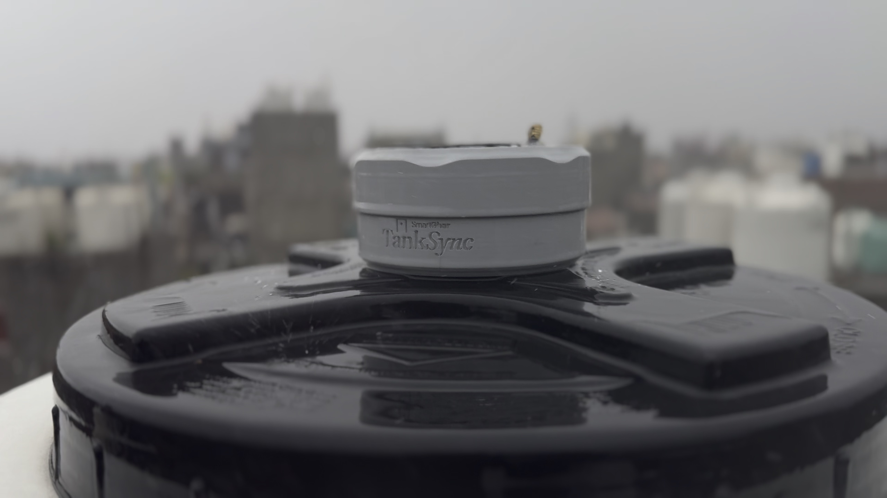

# TankSync™ — reliable smart water monitoring

[](https://shop.smartghar.org)
[](LICENSE)
[](hardware/LICENSE)
[](https://docs.espressif.com/projects/esp-idf/)
[](https://github.com/Techposts/smartghar-homeassistant)

**Never worry about your water tank again.** A solar-powered sensor on the rooftop, a quiet hub on the wall, and smart water monitoring that keeps working — even when the internet doesn't. Long-range LoRa (RYLR998) to an ESP32 hub, local web UI, Home Assistant via HACS, optional cloud PWA. Open at the core.

<p align="center">
  
  
  
</p>
<p align="center">
  <sub><em>The indoor hub (left), the solar tank sensor with non-contact ultrasonic measurement (centre), and the custom circular TX PCB (right) — current production hardware, REV 2.2 (May 2026), tested through Delhi summer at 45°C ambient.</em></sub>
</p>

## Watch the story — Episode 1

<p align="center">
  <a href="https://www.youtube.com/watch?v=ZZt6cZbWM0g">
    
  </a>
</p>
<p align="center">
  <sub><em>Why I built TankSync, the local-first philosophy, and how the rooftop sensor + indoor hub stay reliable when the internet doesn't. <a href="https://www.youtube.com/watch?v=ZZt6cZbWM0g">Watch on YouTube →</a></em></sub>
</p>

## Try the in-browser flasher first

👉 **[tanksync.smartghar.org/firmware/](https://tanksync.smartghar.org/firmware/)**

No `esptool`, no Python, no CLI. Plug your board into USB, click Install, the browser does the flashing through WebSerial. Works on Chrome/Edge desktop. Takes ~45 seconds per board.

## Why TankSync — engineered to be reliable, not just smart

Most "smart tank" products treat the cloud as the product. TankSync treats **reliability** as the product — and the cloud as an optional layer of polish on top.

- **Works fully offline.** Hub keeps showing levels, lighting the LED ring, and beeping on overflow — even when your WiFi, your ISP, or our cloud is down. Local operation is the default; cloud is opt-in.
- **Long-range LoRa, no rooftop WiFi.** Sensor talks to the hub over 865 MHz LoRa — through concrete walls, between floors, across a property. Up to 5 km line-of-sight. The rooftop doesn't need WiFi. Ever.
- **Solar-powered transmitter.** Mounts on the tank lid. Charges in regular daylight, runs on a single 18650, deep-sleeps between readings. Months of autonomy. No wires to the tank.
- **Home Assistant native.** Auto-discovery via MQTT plus a dedicated [HACS integration](https://github.com/Techposts/smartghar-homeassistant) — every tank shows up as an HA device with live sensors, fill events, and editable settings.
- **Open at the core.** Firmware (AGPL-3.0), hardware (CC BY-SA 4.0), schematics, BOM, and flashing tools are all public. Self-host it. Fork it. Modify it. Audit it. No vendor lock-in.
- **Built for Indian realities.** Designed and tested through Delhi summer (45 °C ambient). UV-stabilised PETG, IP65 sealing, monsoon-ready. Engineered for terrace tanks, high-rise apartments, thick walls, and unreliable connectivity.

## Get the hardware

<table>
<tr>
<td width="42%" valign="middle">
  
</td>
<td valign="middle">
  <h3>Skip the build — Developer Edition kits are on pre-order.</h3>
  <p>Hub + solar sensor + all the bits. First batch ships end of July / early August 2026.</p>
  <p><b>→ <a href="https://shop.smartghar.org">shop.smartghar.org</a></b></p>
  <p><sub>Indian buyers: bank transfer accepted today. PayPal for international buyers going live this week.</sub></p>
  <p><sub>Or build it yourself — full BOM, schematics, and firmware are below. A free tier on the cloud is available either way.</sub></p>
</td>
</tr>
</table>

## Architecture

```
                    LoRa 865/915 MHz (up to 5 km, through walls)
                    ==============================================>
  TRANSMITTER                                          HUB (RECEIVER)
  ESP32-C3 SuperMini/Pro Mini                          ESP32-S3
  + JSN-SR04T Ultrasonic                               + RYLR998 LoRa
  + RYLR998 LoRa                                       + GC9A01 round TFT
  + 18650 + solar                                      + WS2812 LED ring
                                                       + WiFi (optional)
                                                          |
                                              +-----------+-----------+
                                              |                       |
                                       MQTT (TLS)              Local web UI
                                              |              192.168.x.x
                                    +---------+---------+
                                    |                   |
                              Home Assistant      Cloud dashboard
                              (HACS integration)  (optional, hosted)
```

## Hardware

| Component | Part | Approx cost (INR) |
|-----------|------|-------------------|
| Receiver MCU (hub) | ESP32-S3 module | ₹450–700 |
| Transmitter MCU | ESP32-C3 SuperMini / Pro Mini | ₹200 |
| LoRa module | REYAX RYLR998 (×2) | ₹650 each |
| Ultrasonic sensor | JSN-SR04T (waterproof) | ₹350 |
| Display (hub) | GC9A01 1.28" round TFT | ₹300 |
| Battery | Protected 18650 + holder | ₹200 |
| Solar charger | CN3791 MPPT module | ₹120 |
| Boost converter | MT3608 3.7 V → 5 V | ₹50 |

Total: **~₹3,800-5,200 per complete system** (one hub + one tank). Per-tank addition: ~₹1,500.

📐 **[Detailed wiring + pin maps →](hardware/README.md)**
📋 **[Full BOM →](hardware/BOM.csv)**

## Quick start

### Option 1: Browser flasher (easiest — no install)

👉 **[tanksync.smartghar.org/firmware/](https://tanksync.smartghar.org/firmware/)**

Plug your board into a USB port, pick the right card (Receiver Hub or Transmitter), click Install. Done in ~45 sec.

### Option 2: esptool (CLI)

Download the latest `.bin` from [Releases](../../releases).

```bash
# Receiver / Hub (ESP32-S3) — full image, flash at 0x0
esptool --chip esp32s3 -b 460800 write_flash 0x0 tanksync-receiver-esp32s3-cam-vX.Y.Z-full.bin

# Transmitter (ESP32-C3 SuperMini / Pro Mini) — full image, flash at 0x0
esptool --chip esp32c3 -b 460800 write_flash 0x0 tanksync-transmitter-lora-esp32c3-vX.Y.Z-full.bin

# (Legacy ESP32 DevKit hubs: use tanksync-receiver-esp32-vX.Y.Z-full.bin with --chip esp32.)
```

### Option 3: Build from source

> **Note on source versions.** The firmware source in this repo corresponds to the **rx-v2.8.6 / tx-v2.0.15** line (and earlier) and is licensed AGPL-3.0 — build it, audit it, fork it. Releases **after** that version are published as ready-to-flash **binaries** (see [Releases](../../releases)) rather than source. The full local-first feature set and the in-browser flasher work with both.

Prerequisites: [ESP-IDF v5.5+](https://docs.espressif.com/projects/esp-idf/en/latest/esp32/get-started/)

```bash
# Receiver Hub
cd firmware/Receiver-ESP32-DevKit
idf.py build
idf.py -p /dev/ttyUSB0 flash

# Transmitter
cd firmware/Transmitter-IDF
idf.py set-target esp32c3
idf.py build
idf.py -p /dev/ttyACM0 flash
```

### First boot

1. **Hub** starts in AP mode → connect to `TankSync-XXXX` WiFi from your phone
2. Captive portal opens (or visit `192.168.4.1`)
3. Configure home WiFi + (optional) MQTT broker + LoRa settings

## What you'll use it through

Two surfaces — pick either, or both. They show the same data.

<p align="center">
  
  
</p>
<p align="center">
  <sub><em>Left: the PWA at <a href="https://tanksync.smartghar.org">tanksync.smartghar.org</a> — works from anywhere. Right: the hub's local web UI — works fully offline. Full walkthrough in the <a href="https://github.com/Techposts/TankSync/wiki">Wiki</a>.</em></sub>
</p>

4. **Transmitter** pairs over the air — hold its `BOOT` button ~3 sec (hub LED turns green when paired). Holding `BOOT` for **>5 sec** after a reset puts the transmitter into **Wi-Fi AP mode** for local firmware updates + diagnostics.

## Photos of a real build

<p align="center">
  
  
</p>
<p align="center">
  <sub><em>Renders of the production sensor — the threaded boss + hex lock-nut secure the sensor through a standard tank-lid hole; the solar panel sits flush on the case top.</em></sub>
</p>

<p align="center">
  
  
  
</p>
<p align="center">
  
  
  
</p>

More photos + STL files for the case + schematics + 3D STEP models: **[hardware/](hardware/)**.

## Home Assistant integration

Two routes — pick whichever fits your setup:

1. **Native MQTT auto-discovery** — the hub publishes auto-discovery topics; tanks appear in HA as sensor entities with zero setup beyond pointing HA at the same broker. Read-only.
2. **HACS integration: SmartGhar** — full bidirectional control. Every tank is an HA device with grouped Sensors / Events / Configuration / Diagnostic entities, plus a hub device with buzzer + LED controls. **Capacity, sleep interval, samples-per-wake are editable from inside HA** and ride the same MQTT command channel as the PWA, so both stay in sync.

<p align="center">
  
  
  
  
  
</p>

**HACS repo:** [github.com/Techposts/smartghar-homeassistant](https://github.com/Techposts/smartghar-homeassistant) · **Full setup + entity reference:** [HACS Integration wiki page](https://github.com/Techposts/TankSync/wiki/HACS-Integration)

## What's NOT in this repo (and why)

This is the open-source TankSync firmware + hardware mirror. The hosted cloud dashboard (PWA at [tanksync.smartghar.org](https://tanksync.smartghar.org)) is a separate **proprietary** product that adds:

- Remote access from anywhere (no port forwarding)
- Push notifications to your phone
- Multi-tank history + insights
- QR-code device linking
- Multi-hub fleet management for societies, farms, hotels

The firmware works fully **without** the cloud — local web UI on the hub gives you tank levels, settings, OTA updates, Home Assistant integration. Cloud is opt-in convenience, never a dependency.

## Licenses

| Component | License | What this means |
|---|---|---|
| Firmware source (`firmware/`) | [AGPL-3.0](LICENSE) | Source through **rx-v2.8.6 / tx-v2.0.15**. Free for personal + community use; commercial users who modify and distribute must open-source their changes under AGPL. |
| Newer firmware (Releases) | Binary, proprietary | Versions after the line above ship as ready-to-flash `.bin` files. Free to download and flash on TankSync™ hardware; not redistributable or reverse-engineerable for resale. |
| Hardware (`hardware/`) | [CC BY-SA 4.0](hardware/LICENSE) | Attribution + ShareAlike. Build it, sell it, modify it — credit the source and share-alike. |
| HA Integration | [MIT](https://github.com/Techposts/smartghar-homeassistant/blob/main/LICENSE) (separate repo) | Frictionless for HA ecosystem. |

**Why a source freeze + binary releases?** The published firmware source (rx-v2.8.6 / tx-v2.0.15 and earlier, AGPL-3.0) stays open for hobbyists and HA users to build, audit, and fork. Development now focuses on the cloud platform, so newer firmware is distributed as binaries instead of source — the local-first experience is unchanged, and the in-browser flasher always carries the latest build. If you want a commercial firmware license for embedded use, reach out to the maintainer.

## Contributing

Issues and PRs welcome. Read the [hardware guide](hardware/README.md) before opening hardware-related issues.

## Author + brand

**Ravi Singh** ([@ravis1ngh on YouTube](https://www.youtube.com/@ravis1ngh)) — solo-building open-source home infrastructure in India under the **TechPosts Media** / **SmartGharLabs™** banner. Design, firmware, hardware, PCB layouts, and 3D-printed enclosures — all done in-house.

**TankSync™** is part of the **SmartGhar** ecosystem ([smartghar.org](https://smartghar.org)) — calm, local-first smart-home infrastructure engineered for real-world Indian deployments.

<sub>TankSync™ and SmartGharLabs™ are trademarks of SmartGharLabs.</sub>
